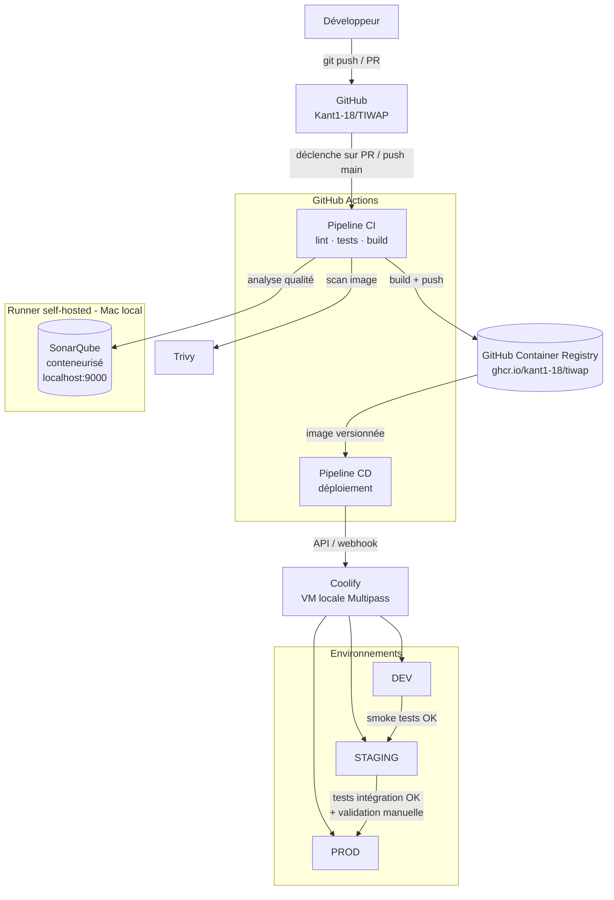

# Architecture globale — TIWAP CI/CD

## Contexte

TIWAP est une application Flask + MongoDB volontairement vulnérable (lab de sécurité,
type DVWA). Ce document décrit l'architecture cible mise en place pour industrialiser sa
livraison : intégration continue, contrôle qualité, contrôle de sécurité, publication
d'image et déploiement continu sur trois environnements.

Aucun fichier YAML de pipeline n'est écrit à ce stade — cette étape ne fixe que les
composants et leurs interactions.

## Schéma d'architecture

## Composants

| Composant | Rôle | Où il tourne |
|---|---|---|
| GitHub | Hébergement du code, Pull Requests, déclencheur des pipelines | Cloud |
| GitHub Actions | Orchestration CI et CD | Cloud (jobs standards) + runner self-hosted (jobs ayant besoin du réseau local) |
| SonarQube (conteneurisé) | Analyse statique de la qualité du code | Docker local, sur le Mac de développement |
| Trivy | Scan de vulnérabilités de l'image Docker | Job GitHub Actions (aucune dépendance réseau locale) |
| GitHub Container Registry (GHCR) | Stockage et versionnage des images Docker | Cloud (GitHub) |
| Coolify | Plateforme de déploiement PaaS auto-hébergée | VM Ubuntu locale (Multipass), pilotée via API/webhook |

## Pourquoi un runner self-hosted ?

SonarQube et Coolify tournent en local (pas de VPS pour ce projet). Les runners GitHub
hébergés par GitHub (`ubuntu-latest`) ne peuvent pas atteindre `localhost` ni le réseau
local de la machine de développement. Un runner **self-hosted**, installé directement sur
cette machine, résout le problème : il exécute les jobs qui doivent parler à SonarQube ou
déclencher un déploiement Coolify, pendant que les jobs indépendants du réseau local
(lint, tests, build, Trivy, push GHCR) restent sur des runners cloud standards, plus
rapides et toujours disponibles.

## Environnements

| Environnement | Objectif | Déploiement |
|---|---|---|
| DEV | Validation immédiate après fusion sur `main` | Automatique |
| STAGING | Validation fonctionnelle avant production | Automatique après succès des smoke tests DEV |
| PROD | Environnement utilisateur final | Automatique après validation manuelle (reviewer GitHub) |

Voir [`pipeline.md`](./pipeline.md) pour le détail des étapes et
[`git-strategy.md`](./git-strategy.md) pour la stratégie Git, les outils et les
déclencheurs.
