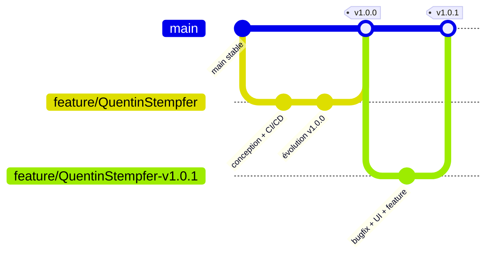

# Stratégie Git, outils et environnements — TIWAP

## Stratégie Git retenue : Feature Branch (GitHub Flow)

Chaque évolution est développée sur une branche dédiée `feature/<NomPrenom>`, fusionnée
dans `main` via une **Pull Request** obligatoire. `main` reste toujours déployable :
c'est la branche qui alimente la pipeline CD.

### Pourquoi ce choix plutôt que Trunk Based ou GitFlow ?

| Critère | Trunk Based | Feature Branch (retenu) | GitFlow |
|---|---|---|---|
| Taille de l'équipe / du projet | Idéal pour équipes matures poussant en continu sur `main` | Adapté à un projet étudiant avec relecture obligatoire par PR | Pensé pour des cycles de release longs, multi-branches |
| Contrainte du sujet | Ne permet pas d'imposer une revue par Pull Request avant fusion | Correspond exactement à la consigne (branche `feature/*` + PR obligatoire) | Complexité (develop/release/hotfix) disproportionnée pour ce projet |
| Complexité pipeline | Très simple mais pas de porte de revue | Simple : une seule pipeline, un seul chemin de fusion | Pipeline différente par type de branche, effort de maintenance élevé |

Le Feature Branch workflow est donc le compromis retenu : assez simple pour garder une
pipeline unique et lisible, tout en respectant l'obligation de Pull Request du sujet.

## Environnements

| Environnement | But | Promotion |
|---|---|---|
| DEV | Vérification immédiate après fusion | Automatique à chaque fusion sur `main` |
| STAGING | Répétition générale avant production | Automatique si les smoke tests DEV passent |
| PROD | Utilisateurs finaux | Manuelle (validation humaine) après les tests d'intégration STAGING |

## Outils retenus

| Domaine | Outil | Justification |
|---|---|---|
| Hébergement du code / PR | GitHub | Dépôt existant du projet (fork `Kant1-18/TIWAP`) |
| Orchestrateur CI/CD | GitHub Actions | Intégré à GitHub, gratuit pour ce volume, supporte les runners self-hosted |
| Qualité de code | SonarQube (conteneurisé) | Analyse statique multi-langages, Quality Gate bloquant |
| Sécurité (image) | Trivy | Scan de CVE simple à intégrer en action GitHub, gratuit |
| Registre d'images | GitHub Container Registry (GHCR) | Intégré à GitHub, authentification via `GITHUB_TOKEN`, pas de compte tiers |
| Déploiement | Coolify | PaaS auto-hébergé, gère les 3 environnements via API/webhook sans dépendre d'un cloud payant |
| Runner d'exécution | Self-hosted (local) + `ubuntu-latest` (cloud) | SonarQube et Coolify tournent en local ; seuls les jobs qui doivent les atteindre utilisent le runner self-hosted |

## Déclencheurs du pipeline

| Déclencheur | Effet |
|---|---|
| `pull_request` → `main` | Exécute la pipeline CI complète (lint, tests, SonarQube, build, Trivy) sans publier ni déployer |
| `push` → `main` (fusion de PR) | Exécute la CI puis, si succès, publie l'image sur GHCR et démarre la CD (DEV → STAGING → PROD) |
| Approbation manuelle sur l'environnement GitHub `production` | Débloque le déploiement PROD |

## Règle sur les échecs

Conformément au sujet, toute étape en échec arrête immédiatement la suite de la
pipeline — que ce soit en CI (lint, tests, Sonar, build) ou en CD (échec de déploiement
ou de smoke test). Seul le scan Trivy est un rapport non bloquant (voir
[`pipeline.md`](./pipeline.md)), car TIWAP est une application volontairement
vulnérable dont les dépendances anciennes contiennent des CVE connues par construction.
