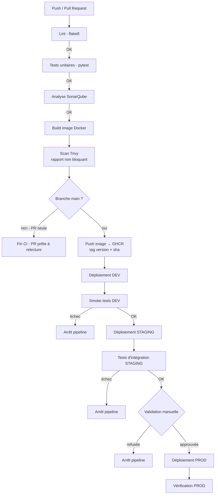

# Pipeline CI/CD — TIWAP

## Vue d'ensemble

La chaîne de livraison est découpée en deux pipelines distinctes mais chaînées : une
pipeline **CI** (intégration continue, déclenchée par le code) et une pipeline **CD**
(déploiement continu, déclenchée par le succès de la CI sur `main`). Chaque étape doit
réussir pour que la suivante démarre — un échec arrête immédiatement la chaîne.

## Diagramme de la pipeline

## Étapes détaillées

### Pipeline CI

| Étape | Objectif | Outil | Bloquant ? |
|---|---|---|---|
| Lint | Style et erreurs évidentes du code Python | flake8 | Oui |
| Tests unitaires | Validation fonctionnelle de base | pytest | Oui |
| Analyse qualité | Dette technique, bugs, code smells, vulnérabilités de code | SonarQube (conteneurisé) | Oui (Quality Gate) |
| Build | Fabrication de l'image Docker versionnée | Docker Buildx | Oui |
| Scan sécurité image | Détection des CVE dans l'image | Trivy | Non — rapport publié (résumé de job + onglet Security GitHub), l'application étant un lab volontairement vulnérable |
| Publication | Mise à disposition de l'artefact versionné | GitHub Container Registry | Oui (uniquement sur `main`) |

### Pipeline CD

| Étape | Objectif | Bloquant ? |
|---|---|---|
| Déploiement DEV | Mettre à disposition la dernière version fusionnée | Oui |
| Smoke tests DEV | Vérifier que l'application démarre et répond | Oui |
| Déploiement STAGING | Valider la version dans un environnement proche de la prod | Oui |
| Tests d'intégration STAGING | Vérifier les parcours fonctionnels clés | Oui |
| Validation manuelle | Décision humaine avant mise en production | Oui (environnement GitHub protégé) |
| Déploiement PROD | Mise à disposition finale | Oui |
| Vérification PROD | Confirmer le bon fonctionnement post-déploiement | Oui |

## Principe Build Once, Deploy Many

Une seule image Docker est construite par version (`ghcr.io/kant1-18/tiwap:<version>`).
Cette même image est déployée telle quelle sur DEV, STAGING puis PROD — jamais
recompilée. C'est ce qui garantit que ce qui est testé en DEV et STAGING est exactement
ce qui tourne en production.

## Déclencheurs

| Événement | Pipeline déclenchée | Détail |
|---|---|---|
| Ouverture / mise à jour d'une Pull Request vers `main` | CI | Lint, tests, SonarQube, build, scan Trivy. Pas de publication ni de déploiement. |
| Fusion (push) sur `main` | CI puis CD | CI complète + publication GHCR, puis déclenchement automatique de la CD (DEV → STAGING → PROD). |
| Validation manuelle sur l'environnement `production` | Poursuite de la CD | Un reviewer humain doit approuver avant le déploiement PROD (règle de protection d'environnement GitHub). |
